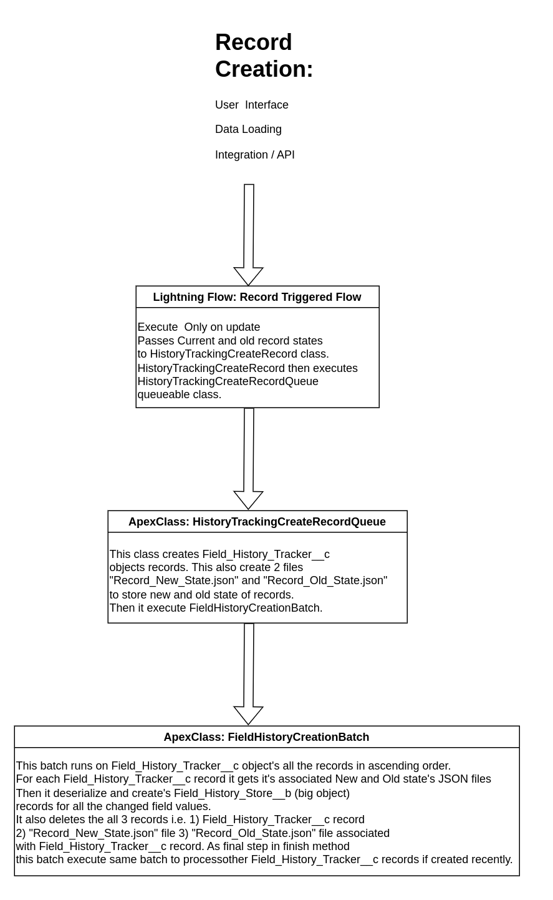

## This application is a highly scalable field history tracking solution that supports efficient data loading. It utilizes big objects to store field tracking history records. With this application, you have the flexibility to track an unlimited number of fields across multiple objects. Additionally, it provides the capability to track Long Text Area fields as well, offering comprehensive tracking capabilities for a wide range of field types.

# Install and use as unmanaged package
Package URL :  [https://login.salesforce.com/packaging/installPackage.apexp?p0=04t5w000005qy5iAAA](https://login.salesforce.com/packaging/installPackage.apexp?p0=04t5w000005qy5iAAA)   
Keyphrase for installation: **infoklpa**

# The execution flow is shown in below diagram.

# How to setup Field history tracking for an object.
Lets take example if you are creating field history tracking for contact object.
## Step 1 : Create a flow 
1. create new record triggered lightning flow on contact object. Select "A record is updated" with all other default settings.
2. Add an element and select apex action, under the action select "insert history record" action. 
3. Give any appropriate name to action. Under newRecordState and  oldRecordState for input and output select contact object on all 4 fields.
4. Under "Set Input Values" section for newRecordState put {!$Record}  and on oldRecordState put {!$Record__Prior}. Don't include other 2 inputs.
5. Save and activate the flow.
## Step 2 : Create Custom metadata type record
1. Go to Setup > Custom Metadata Types and click "Object History Tracking" custom metadata type.
2. Create new record by clicking "Manage Object History Tracking" and then "New" buttons.
3. Give any appropriate label like "ContactFieldHistoryTracking" and accept default "Object History Tracking Name" and select Contact in the dropdown under Tracking object. Now under "Tracked Fields List" you can put any number of standard and custom fields to track changes on them. For example "Name,Phone,Email". Now Save the record.
## Step 3 : Assign 'Field History Tracker PS' Permission Set to all the required users
1. Go to setup and Permission Sets and then 'Field History Tracker PS' permission set. Then click on "Manage Assignments" and then "Add Assignment" button.
2. Select all the required users and complete the assignment. You can use other ways or include this into any existing permission set group as well.

## Step 4) Include field history records related list under desired object
1. Go to any record of that object (Contact record in our case) and click "Edit Page". 
2. Drag and drop "Big Object Related List - Single" custom component into Related list tab (or any other appropriate place). There are some configuration options available to configure this related list please refer "Configuration options" section for more details.
3. Save the page and Activate it.

# Configuration options

# caveats
1. If you choose to manually 'abort' the FieldHistoryCreationBatch, it is important to ensure that you also delete all "Field_History_Tracker__c" records with the record type "Batch_Info". This can be done using the following query: "SELECT Id FROM Field_History_Tracker__c WHERE RecordType.DeveloperName = 'Batch_Info'".
2. In this application history creation process in asynchronous process, hence it takes some time (like 15 to 30 seconds) to reflect histories to appear in related list after changes on the field values. But time may depends of time take by queueable jobs to start which salesforce controls internally based on load and other factors.
3. Due to the inherent limitations of big objects, running reports directly on them is not supported. Consequently, creating reports on field history tracking for big objects is also not possible. However, you can export the data and leverage analytics tools to generate the desired reports.

